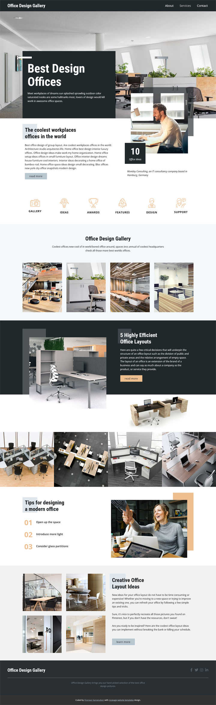

# Nicepage - Office Design Gallery

This is a website design made with the help of a design inspired by one of the [Nicepage](https://nicepage.com/) [webisite template](https://nicepage.com/website-templates). This is done as part of my practice designing and developing websites and all the contents and images are copied from the template. HTML, CSS and JavaScript codes of the website are done myself except for the content and images. This is only done for practice and not for any commercial use.

### Screenshot

### Links

- Solution URL: [Click here](https://github.com/shameerkamaludeen/office-design-gallery)
- Live Site URL: [Click here](https://shameerkamaludeen.github.io/office-design-gallery/)

### Built with

- Semantic HTML5 markup
- Flexbox
- CSS Grid
- Mobile-first workflow
- CSS custom properties

## Author

- Github - [Shameer Kamaludeen](https://github.com/shameerkamaludeen)
- Frontend Mentor - [@shameerkamaludeen](https://www.frontendmentor.io/profile/shameerkamaludeen)
- Twitter - [@ShameerKamalud1](https://twitter.com/ShameerKamalud1)

## Acknowledgments

Thanks to the Nicepage website where I picked the template to design from.